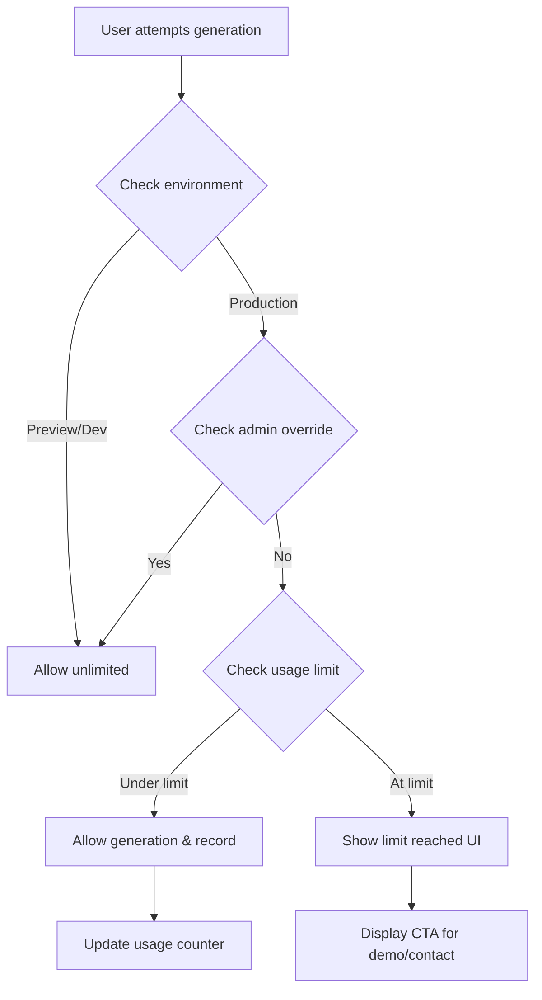

# Piktor Usage Limiting System - Implementation Guide

## 🎯 Overview

The Piktor usage limiting system provides comprehensive control over image generation limits with environment-based behavior, admin overrides, and seamless user experience. This implementation supports your SaaS beta requirements while maintaining testing flexibility.

## 🏗️ Architecture

### Core Components

1. **Usage Limiting Utilities** (`/src/lib/usage-limits.ts`)
   - Environment detection (preview/production/development)
   - Usage tracking and persistence
   - Admin override management
   - Limit checking and enforcement

2. **React Context Provider** (`/src/contexts/UsageLimitContext.tsx`)
   - Centralized state management
   - React hooks for easy integration
   - Real-time usage updates

3. **UI Components** (`/src/components/UsageLimitReached.tsx`)
   - Post-limit user experience
   - Contact/demo CTAs
   - Social proof elements

4. **Server-side Validation** (`/src/app/api/generate-images-direct/route.ts`)
   - Additional security layer
   - Rate limiting enforcement
   - Environment-aware processing

## 🚀 Features

### Environment-Based Behavior

| Environment | Behavior | Use Case |
|-------------|----------|----------|
| **Preview Branch** | ✅ Unlimited generations | Testing new features |
| **Development** | ✅ Unlimited generations | Local development |
| **Production** | 🚫 5 generation limit | Beta user restrictions |

### Admin Override System

- **Query Parameter**: `?admin=true` (enables admin mode)
- **Local Storage**: Persistent admin status across sessions
- **Server Headers**: `x-admin-override: true` for API calls
- **Console Commands**: `piktorAdmin.enableAdmin()` for testing

### Usage Tracking

- **Storage Method**: localStorage (configurable to sessionStorage/cookies)
- **Persistence**: Survives browser restarts
- **Data Structure**: Generation count, timestamps, session ID, environment
- **Privacy**: All data stored locally, no server tracking

## 🛠️ Implementation Details

### Environment Detection Logic

```typescript
// Automatic detection based on:
1. hostname (localhost = development)
2. Vercel environment variables
3. URL patterns (preview- prefixes)
4. Domain patterns (admin subdomain)
```

### Usage Flow



### API Security Layer

```typescript
// Server-side checks include:
- Environment validation
- Usage count verification via headers
- Admin override validation
- Rate limiting by IP/session
- Proper error responses (429 status)
```

## 🎮 Testing & Debugging

### Development Console Commands

Open browser developer console and use:

```javascript
// Enable unlimited generations
piktorAdmin.enableAdmin()

// Reset usage counter
piktorAdmin.resetUsage()

// Set usage to 4/5 (testing near-limit state)
piktorAdmin.setNearLimit()

// Set usage to 5/5 (testing limit-reached state)
piktorAdmin.setAtLimit()

// Show current usage state
piktorAdmin.debug()

// Show all available commands
piktorAdmin.help()
```

### Testing Scenarios

1. **Fresh User Experience**
   - Open incognito window
   - Should show 5/5 generations available
   - Usage counter updates after each generation

2. **Limit Reached Experience**
   - Use `piktorAdmin.setAtLimit()`
   - Upload area should be replaced with CTA
   - Generate button should be disabled

3. **Admin Override Testing**
   - Use `piktorAdmin.enableAdmin()`
   - Should bypass all limits
   - Usage counter should show "unlimited"

4. **Environment Testing**
   - Deploy to Vercel preview branch
   - Should automatically detect and allow unlimited
   - Production deployment should enforce limits

## 🔧 Configuration

### Usage Limit Settings

```typescript
// Default configuration in UsageLimitProvider
{
  maxGenerations: 5,           // Beta limit
  trackingMethod: 'localStorage', // Storage method
  storageKey: 'piktor_usage_data', // Storage key
  adminBypassKey: 'piktor_admin_bypass' // Admin flag key
}
```

### Environment Variables

No additional environment variables required. The system uses:
- `NODE_ENV` for development detection
- `VERCEL_ENV` for deployment environment detection

## 🎨 User Experience

### Normal Usage Flow

1. **Initial State**: Shows "5 generations remaining"
2. **After Generation**: Updates to "4 generations remaining"
3. **Near Limit**: Visual warnings at 2 remaining
4. **Limit Reached**: Replaces interface with contact CTA

### Limit Reached Interface

- **Hero Section**: Congratulatory message with success indicators
- **Feature Showcase**: What they get with full access
- **Primary CTA**: "Book personalized demo" 
- **Secondary CTA**: "Contact us"
- **Social Proof**: Testimonials and trust indicators

### Admin Experience

- **Unlimited Badge**: Visual indicator of admin status
- **Debug Information**: Usage state and environment info
- **Reset Controls**: Easy testing utilities
- **Console Commands**: Full debugging toolkit

## 📊 Analytics & Monitoring

### Client-side Tracking

- Generation count per session
- First/last generation timestamps
- Environment detection accuracy
- Admin override usage

### Server-side Logging

- Usage limit violations
- Environment detection results
- Admin override attempts
- API rate limiting events

## 🔐 Security Considerations

### Client-side Security

- Storage encryption (optional enhancement)
- Admin key rotation
- Usage data validation
- Environment spoofing protection

### Server-side Security

- Header validation
- IP-based rate limiting
- Admin privilege verification
- Request signature validation (future enhancement)

## 🚢 Deployment

### Preview Branch Testing

1. Deploy to preview branch
2. Should automatically detect environment
3. Test unlimited generation capability
4. Verify admin tools work correctly

### Production Deployment

1. Deploy to main branch
2. Verify 5-generation limit enforcement
3. Test limit-reached user experience
4. Confirm admin override functionality

## 🔄 Maintenance

### Regular Tasks

- Monitor usage patterns
- Update generation limits as needed
- Review admin access logs
- Test environment detection accuracy

### Potential Enhancements

1. **Server-side Usage Tracking**: Store usage in database
2. **User Authentication**: Tie limits to user accounts
3. **Dynamic Limits**: Adjust based on user tier
4. **Usage Analytics**: Detailed reporting dashboard
5. **A/B Testing**: Test different limit values

## 🆘 Troubleshooting

### Common Issues

**"Unlimited generations in production"**
- Check environment detection with `piktorAdmin.debug()`
- Verify VERCEL_ENV settings
- Clear admin override with `piktorAdmin.disableAdmin()`

**"Limit not enforcing"**
- Check localStorage data
- Verify API headers are being sent
- Test server-side validation

**"Wrong environment detected"**
- Check hostname patterns
- Verify Vercel deployment settings
- Test URL-based detection logic

### Debug Checklist

- [ ] Environment correctly detected
- [ ] Usage data persisting in localStorage
- [ ] API calls include usage headers
- [ ] Server-side validation working
- [ ] Admin override toggles correctly
- [ ] Limit reached UI displays properly

## 📞 Support

For implementation questions or issues:

1. Check browser console for error messages
2. Use `piktorAdmin.debug()` for current state
3. Verify network requests in DevTools
4. Test in different environments (dev/preview/prod)

---

**Implementation Status**: ✅ Complete
**Last Updated**: 2025-09-09
**Version**: 1.0.0